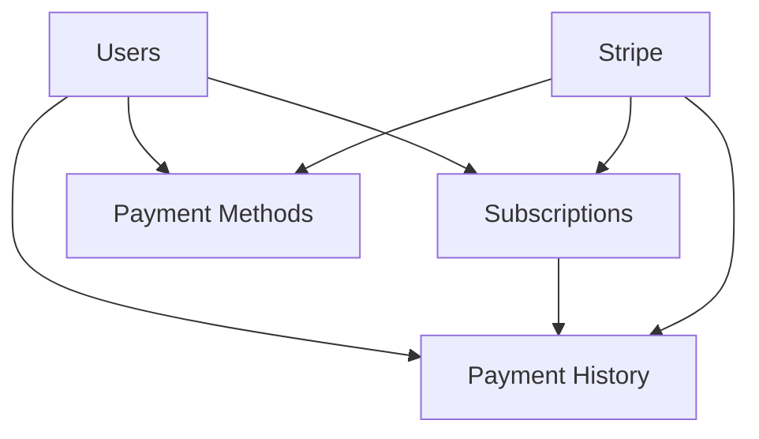

# 🚀 Backend Implementation Requirements - Payment System

## 📋 **Project Overview**

The HyperBuds payment system frontend is **100% complete and production-ready**. This document outlines exactly what the backend team needs to implement to make the payment system fully functional.

## ✅ **Frontend Status - COMPLETE**

### **What's Already Built**
- ✅ **Complete Payment Form** - Stripe Elements + manual card entry
- ✅ **Plan Selection** - Basic, Premium, Enterprise tiers
- ✅ **Form Validation** - Real-time client-side validation
- ✅ **Error Handling** - Comprehensive error management
- ✅ **Responsive Design** - Mobile and desktop layouts
- ✅ **Dark Mode** - Full theme support
- ✅ **Accessibility** - ARIA compliance and keyboard navigation
- ✅ **State Management** - React Context with proper error recovery
- ✅ **API Service Layer** - Complete integration layer ready for backend

### **What's Mocked (Waiting for Backend)**
- ❌ **Payment Processing** - Currently simulated
- ❌ **API Endpoints** - All calls are mocked
- ❌ **Database Operations** - No real data persistence
- ❌ **Authentication** - Uses localStorage token

## 🎯 **Backend Implementation Tasks**

### **Priority 1: Core Payment API** (Week 1)

#### **1.1 Payment Intent Endpoints**
```typescript
// Required Endpoints
POST /api/v1/payments/intent
GET /api/v1/payments/intent/:id
POST /api/v1/payments/confirm
```

**Implementation Details:**
- Create payment intents with Stripe
- Handle payment confirmation
- Store payment metadata
- Return proper error responses

#### **1.2 Subscription Management**
```typescript
// Required Endpoints
POST /api/v1/payments/subscriptions
GET /api/v1/payments/subscriptions/:id
PUT /api/v1/payments/subscriptions/:id
DELETE /api/v1/payments/subscriptions/:id
```

**Implementation Details:**
- Create Stripe subscriptions
- Handle plan changes
- Manage subscription lifecycle
- Webhook integration for status updates

#### **1.3 Payment Methods**
```typescript
// Required Endpoints
GET /api/v1/payments/methods
POST /api/v1/payments/methods
DELETE /api/v1/payments/methods/:id
```

**Implementation Details:**
- Store customer payment methods
- Handle Stripe payment method creation
- Manage default payment methods
- Secure token storage

### **Priority 2: Database Schema** (Week 1)

#### **2.1 Core Tables**
```sql
-- Users table (if not exists)
CREATE TABLE users (
    id UUID PRIMARY KEY,
    email VARCHAR(255) UNIQUE NOT NULL,
    created_at TIMESTAMP DEFAULT NOW(),
    updated_at TIMESTAMP DEFAULT NOW()
);

-- Subscriptions table
CREATE TABLE subscriptions (
    id UUID PRIMARY KEY,
    user_id UUID REFERENCES users(id),
    stripe_subscription_id VARCHAR(255) UNIQUE,
    tier VARCHAR(50) NOT NULL, -- 'basic', 'premium', 'enterprise'
    status VARCHAR(50) NOT NULL, -- 'active', 'canceled', 'past_due'
    current_period_start TIMESTAMP,
    current_period_end TIMESTAMP,
    created_at TIMESTAMP DEFAULT NOW(),
    updated_at TIMESTAMP DEFAULT NOW()
);

-- Payment methods table
CREATE TABLE payment_methods (
    id UUID PRIMARY KEY,
    user_id UUID REFERENCES users(id),
    stripe_payment_method_id VARCHAR(255) UNIQUE,
    brand VARCHAR(50) NOT NULL,
    last4 VARCHAR(4) NOT NULL,
    exp_month INTEGER NOT NULL,
    exp_year INTEGER NOT NULL,
    is_default BOOLEAN DEFAULT FALSE,
    created_at TIMESTAMP DEFAULT NOW()
);

-- Payment history table
CREATE TABLE payment_history (
    id UUID PRIMARY KEY,
    user_id UUID REFERENCES users(id),
    subscription_id UUID REFERENCES subscriptions(id),
    amount INTEGER NOT NULL, -- in cents
    currency VARCHAR(3) NOT NULL,
    status VARCHAR(50) NOT NULL,
    payment_type VARCHAR(50) NOT NULL,
    stripe_payment_intent_id VARCHAR(255),
    created_at TIMESTAMP DEFAULT NOW()
);
```

#### **2.2 Indexes**
```sql
-- Performance indexes
CREATE INDEX idx_subscriptions_user_id ON subscriptions(user_id);
CREATE INDEX idx_payment_methods_user_id ON payment_methods(user_id);
CREATE INDEX idx_payment_history_user_id ON payment_history(user_id);
CREATE INDEX idx_payment_history_created_at ON payment_history(created_at);
```

### **Priority 3: Stripe Integration** (Week 1)

#### **3.1 Stripe Configuration**
```typescript
// Environment variables needed
STRIPE_SECRET_KEY=sk_test_...
STRIPE_PUBLISHABLE_KEY=pk_test_...
STRIPE_WEBHOOK_SECRET=whsec_...

// Webhook endpoints to implement
POST /api/v1/payments/webhooks/stripe
```

#### **3.2 Webhook Events to Handle**
```typescript
// Required webhook events
'payment_intent.succeeded'
'payment_intent.payment_failed'
'invoice.payment_succeeded'
'invoice.payment_failed'
'customer.subscription.created'
'customer.subscription.updated'
'customer.subscription.deleted'
'payment_method.attached'
'payment_method.detached'
```

### **Priority 4: Authentication Integration** (Week 2)

#### **4.1 JWT Token Validation**
```typescript
// Middleware for all payment endpoints
const authenticateToken = (req, res, next) => {
  const authHeader = req.headers['authorization'];
  const token = authHeader && authHeader.split(' ')[1];
  
  if (!token) {
    return res.status(401).json({ error: 'Authentication token required' });
  }
  
  // Validate JWT token
  // Extract user_id from token
  // Attach to req.user
  next();
};
```

#### **4.2 User Context**
```typescript
// All payment endpoints need user context
interface PaymentRequest extends Request {
  user: {
    id: string;
    email: string;
  };
}
```

### **Priority 5: Error Handling** (Week 2)

#### **5.1 Standardized Error Responses**
```typescript
// Error response format (matches frontend expectations)
interface APIError {
  error: string;
  message: string;
  code?: string;
  details?: any;
}

// Example error responses
{
  "error": "Payment failed",
  "message": "Your card was declined",
  "code": "card_declined"
}

{
  "error": "Validation failed",
  "message": "Invalid payment method",
  "code": "invalid_payment_method"
}
```

#### **5.2 HTTP Status Codes**
```typescript
// Proper status codes for different scenarios
200 - Success
201 - Created (subscription created)
400 - Bad Request (validation errors)
401 - Unauthorized (invalid token)
402 - Payment Required (payment failed)
404 - Not Found (subscription not found)
409 - Conflict (duplicate subscription)
500 - Internal Server Error
```

## 🔧 **Technical Implementation Details**

### **API Base URL**
```
https://api.hyperbuds.com/api/v1/payments
```

### **Request/Response Format**
```typescript
// All requests use JSON
Content-Type: application/json

// All responses include standard format
interface APIResponse<T> {
  success: boolean;
  data: T;
  error?: string;
  message?: string;
}
```

### **Authentication Headers**
```typescript
// All requests require Bearer token
Authorization: Bearer <jwt_token>
```

### **Rate Limiting**
```typescript
// Implement rate limiting
- Payment creation: 10 requests per minute
- Subscription updates: 5 requests per minute
- Payment method operations: 20 requests per minute
```

## 📊 **Database Relationships**



## 🧪 **Testing Requirements**

### **Unit Tests**
- Payment intent creation
- Subscription management
- Payment method operations
- Error handling scenarios

### **Integration Tests**
- Stripe webhook processing
- Database operations
- Authentication flow
- API endpoint responses

### **End-to-End Tests**
- Complete payment flow
- Subscription lifecycle
- Error recovery scenarios
- Performance under load

## 📋 **Implementation Checklist**

### **Week 1: Core Functionality**
- [ ] Set up database schema
- [ ] Implement payment intent endpoints
- [ ] Implement subscription endpoints
- [ ] Set up Stripe integration
- [ ] Implement webhook handling
- [ ] Add basic error handling

### **Week 2: Advanced Features**
- [ ] Implement payment methods management
- [ ] Add authentication middleware
- [ ] Implement payment history
- [ ] Add comprehensive error handling
- [ ] Set up logging and monitoring
- [ ] Add rate limiting

### **Week 3: Testing & Optimization**
- [ ] Write comprehensive tests
- [ ] Performance optimization
- [ ] Security audit
- [ ] Documentation updates
- [ ] Load testing
- [ ] Production deployment

## 🚨 **Critical Requirements**

### **Security**
- ✅ **PCI Compliance** - Use Stripe for all card data
- ✅ **Token Validation** - Verify all JWT tokens
- ✅ **Input Validation** - Sanitize all inputs
- ✅ **Rate Limiting** - Prevent abuse
- ✅ **HTTPS Only** - All endpoints must use HTTPS

### **Performance**
- ✅ **Database Indexing** - Optimize query performance
- ✅ **Caching** - Cache frequently accessed data
- ✅ **Async Processing** - Use queues for heavy operations
- ✅ **Monitoring** - Track performance metrics

### **Reliability**
- ✅ **Error Recovery** - Handle Stripe failures gracefully
- ✅ **Retry Logic** - Implement exponential backoff
- ✅ **Webhook Idempotency** - Prevent duplicate processing
- ✅ **Data Consistency** - Use database transactions

## 📞 **Support & Resources**

### **Frontend Team Contact**
- **Implementation Status**: 100% Complete
- **Testing**: Ready for integration testing
- **Documentation**: Complete API specifications provided

### **Stripe Resources**
- [Stripe API Documentation](https://stripe.com/docs/api)
- [Stripe Webhooks Guide](https://stripe.com/docs/webhooks)
- [Stripe Testing Guide](https://stripe.com/docs/testing)

### **Database Resources**
- [PostgreSQL Documentation](https://www.postgresql.org/docs/)
- [Database Schema Examples](./api-specification.md)

---

**The frontend is ready and waiting for backend implementation! 🚀**

**Estimated Implementation Time: 2-3 weeks**
**Frontend Integration: Ready immediately upon API completion**
