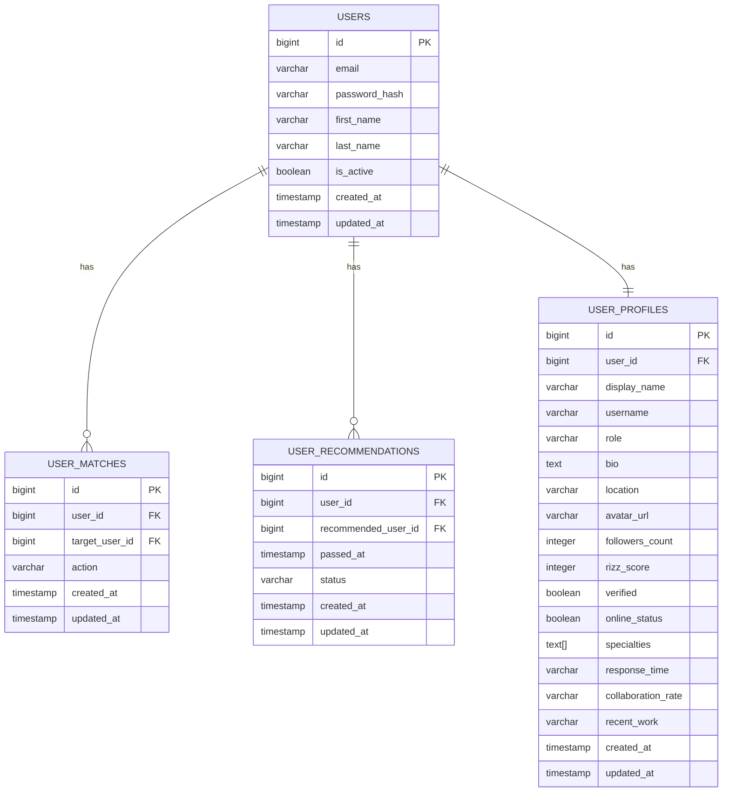

# Database Schema - Recommendations Feature

## 🗄️ Entity Relationship Diagram



## 📊 Table Definitions

### **1. user_matches**
Stores all user matching interactions (likes, passes, etc.)

| Column | Type | Constraints | Description |
|--------|------|-------------|-------------|
| id | BIGSERIAL | PRIMARY KEY | Unique identifier |
| user_id | BIGINT | NOT NULL, FK | ID of the user performing the action |
| target_user_id | BIGINT | NOT NULL, FK | ID of the user being matched |
| action | VARCHAR(20) | NOT NULL | Action type: 'like', 'pass', 'permanently_pass' |
| created_at | TIMESTAMP | DEFAULT CURRENT_TIMESTAMP | When the action was performed |
| updated_at | TIMESTAMP | DEFAULT CURRENT_TIMESTAMP | When the record was last updated |

**Unique Constraint**: (user_id, target_user_id)

### **2. user_recommendations**
Tracks which users are in recommendations and their status

| Column | Type | Constraints | Description |
|--------|------|-------------|-------------|
| id | BIGSERIAL | PRIMARY KEY | Unique identifier |
| user_id | BIGINT | NOT NULL, FK | ID of the user who has recommendations |
| recommended_user_id | BIGINT | NOT NULL, FK | ID of the recommended user |
| passed_at | TIMESTAMP | NOT NULL | When the user was originally passed |
| status | VARCHAR(20) | DEFAULT 'active' | Status: 'active', 'accepted', 'permanently_passed' |
| created_at | TIMESTAMP | DEFAULT CURRENT_TIMESTAMP | When the recommendation was created |
| updated_at | TIMESTAMP | DEFAULT CURRENT_TIMESTAMP | When the record was last updated |

**Unique Constraint**: (user_id, recommended_user_id)

### **3. user_profiles**
Extended user profile information for recommendations

| Column | Type | Constraints | Description |
|--------|------|-------------|-------------|
| id | BIGSERIAL | PRIMARY KEY | Unique identifier |
| user_id | BIGINT | NOT NULL, UNIQUE, FK | Reference to users table |
| display_name | VARCHAR(255) | | User's display name |
| username | VARCHAR(100) | UNIQUE | User's username |
| role | VARCHAR(255) | | User's professional role |
| bio | TEXT | | User's bio/description |
| location | VARCHAR(255) | | User's location |
| avatar_url | VARCHAR(500) | | URL to user's avatar image |
| followers_count | INTEGER | DEFAULT 0 | Number of followers |
| rizz_score | INTEGER | DEFAULT 0 | User's rizz score (0-100) |
| verified | BOOLEAN | DEFAULT FALSE | Whether user is verified |
| online_status | BOOLEAN | DEFAULT FALSE | Whether user is currently online |
| specialties | TEXT[] | | Array of user's specialties/skills |
| response_time | VARCHAR(50) | | Typical response time |
| collaboration_rate | VARCHAR(100) | | Collaboration rate range |
| recent_work | VARCHAR(255) | | Description of recent work |
| created_at | TIMESTAMP | DEFAULT CURRENT_TIMESTAMP | When profile was created |
| updated_at | TIMESTAMP | DEFAULT CURRENT_TIMESTAMP | When profile was last updated |

## 🔍 Indexes

### **user_matches Indexes**
```sql
-- Primary lookup by user
CREATE INDEX idx_user_matches_user_id ON user_matches(user_id);

-- Filter by action type
CREATE INDEX idx_user_matches_action ON user_matches(action);

-- Sort by creation time
CREATE INDEX idx_user_matches_created_at ON user_matches(created_at);

-- Composite index for user + action queries
CREATE INDEX idx_user_matches_user_action ON user_matches(user_id, action);

-- Composite index for target user queries
CREATE INDEX idx_user_matches_target_user ON user_matches(target_user_id);
```

### **user_recommendations Indexes**
```sql
-- Primary lookup by user
CREATE INDEX idx_user_recommendations_user_id ON user_recommendations(user_id);

-- Filter by status
CREATE INDEX idx_user_recommendations_status ON user_recommendations(status);

-- Sort by passed date
CREATE INDEX idx_user_recommendations_passed_at ON user_recommendations(passed_at);

-- Composite index for user + status queries
CREATE INDEX idx_user_recommendations_user_status ON user_recommendations(user_id, status);

-- Composite index for cleanup queries
CREATE INDEX idx_user_recommendations_status_created ON user_recommendations(status, created_at);
```

### **user_profiles Indexes**
```sql
-- Primary lookup by user
CREATE INDEX idx_user_profiles_user_id ON user_profiles(user_id);

-- Sort by rizz score
CREATE INDEX idx_user_profiles_rizz_score ON user_profiles(rizz_score);

-- Filter by location
CREATE INDEX idx_user_profiles_location ON user_profiles(location);

-- Filter by verified status
CREATE INDEX idx_user_profiles_verified ON user_profiles(verified);

-- Filter by online status
CREATE INDEX idx_user_profiles_online ON user_profiles(online_status);

-- GIN index for array search (specialties)
CREATE INDEX idx_user_profiles_specialties ON user_profiles USING GIN(specialties);

-- Composite index for search queries
CREATE INDEX idx_user_profiles_location_rizz ON user_profiles(location, rizz_score);
```

## 🔄 Data Flow

### **1. User Passes on Creator**
```sql
-- Insert into user_matches
INSERT INTO user_matches (user_id, target_user_id, action, created_at)
VALUES ($1, $2, 'pass', CURRENT_TIMESTAMP);

-- Insert into user_recommendations
INSERT INTO user_recommendations (user_id, recommended_user_id, passed_at, status)
VALUES ($1, $2, CURRENT_TIMESTAMP, 'active');
```

### **2. User Gives Another Chance**
```sql
-- Update user_matches
UPDATE user_matches 
SET action = 'like', updated_at = CURRENT_TIMESTAMP
WHERE user_id = $1 AND target_user_id = $2;

-- Update user_recommendations
UPDATE user_recommendations 
SET status = 'accepted', updated_at = CURRENT_TIMESTAMP
WHERE user_id = $1 AND recommended_user_id = $2;
```

### **3. User Permanently Passes**
```sql
-- Update user_matches
UPDATE user_matches 
SET action = 'permanently_pass', updated_at = CURRENT_TIMESTAMP
WHERE user_id = $1 AND target_user_id = $2;

-- Update user_recommendations
UPDATE user_recommendations 
SET status = 'permanently_passed', updated_at = CURRENT_TIMESTAMP
WHERE user_id = $1 AND recommended_user_id = $2;
```

## 📊 Query Examples

### **Get User's Recommendations**
```sql
SELECT 
    up.id,
    up.display_name as name,
    up.role,
    up.followers_count as followers,
    up.location,
    up.avatar_url as img,
    up.rizz_score,
    up.verified,
    up.online_status as online,
    up.specialties,
    up.response_time,
    up.collaboration_rate,
    up.recent_work,
    ur.passed_at,
    EXTRACT(EPOCH FROM (CURRENT_TIMESTAMP - ur.passed_at)) / 86400 as days_ago
FROM user_recommendations ur
JOIN user_profiles up ON ur.recommended_user_id = up.user_id
WHERE ur.user_id = $1 
    AND ur.status = 'active'
ORDER BY ur.passed_at DESC
LIMIT $2 OFFSET $3;
```

### **Get Recommendation Count**
```sql
SELECT COUNT(*) as total
FROM user_recommendations
WHERE user_id = $1 AND status = 'active';
```

### **Cleanup Old Recommendations**
```sql
UPDATE user_recommendations 
SET status = 'expired', updated_at = CURRENT_TIMESTAMP
WHERE status = 'active' 
    AND created_at < CURRENT_TIMESTAMP - INTERVAL '30 days';
```

## 🔧 Migration Scripts

### **Initial Migration**
```sql
-- Create user_matches table
CREATE TABLE user_matches (
    id BIGSERIAL PRIMARY KEY,
    user_id BIGINT NOT NULL,
    target_user_id BIGINT NOT NULL,
    action VARCHAR(20) NOT NULL CHECK (action IN ('like', 'pass', 'permanently_pass')),
    created_at TIMESTAMP DEFAULT CURRENT_TIMESTAMP,
    updated_at TIMESTAMP DEFAULT CURRENT_TIMESTAMP,
    UNIQUE(user_id, target_user_id)
);

-- Create user_recommendations table
CREATE TABLE user_recommendations (
    id BIGSERIAL PRIMARY KEY,
    user_id BIGINT NOT NULL,
    recommended_user_id BIGINT NOT NULL,
    passed_at TIMESTAMP NOT NULL,
    status VARCHAR(20) DEFAULT 'active' CHECK (status IN ('active', 'accepted', 'permanently_passed', 'expired')),
    created_at TIMESTAMP DEFAULT CURRENT_TIMESTAMP,
    updated_at TIMESTAMP DEFAULT CURRENT_TIMESTAMP,
    UNIQUE(user_id, recommended_user_id)
);

-- Create user_profiles table
CREATE TABLE user_profiles (
    id BIGSERIAL PRIMARY KEY,
    user_id BIGINT UNIQUE NOT NULL,
    display_name VARCHAR(255),
    username VARCHAR(100) UNIQUE,
    role VARCHAR(255),
    bio TEXT,
    location VARCHAR(255),
    avatar_url VARCHAR(500),
    followers_count INTEGER DEFAULT 0,
    rizz_score INTEGER DEFAULT 0 CHECK (rizz_score >= 0 AND rizz_score <= 100),
    verified BOOLEAN DEFAULT FALSE,
    online_status BOOLEAN DEFAULT FALSE,
    specialties TEXT[],
    response_time VARCHAR(50),
    collaboration_rate VARCHAR(100),
    recent_work VARCHAR(255),
    created_at TIMESTAMP DEFAULT CURRENT_TIMESTAMP,
    updated_at TIMESTAMP DEFAULT CURRENT_TIMESTAMP
);
```

### **Add Indexes Migration**
```sql
-- Add all indexes as defined above
-- (Include all CREATE INDEX statements from the Indexes section)
```

## 🚨 Constraints & Validation

### **Data Integrity**
- All foreign keys must reference existing users
- Action values must be from allowed list
- Status values must be from allowed list
- Rizz score must be between 0-100
- Timestamps must be valid dates

### **Business Rules**
- Users cannot match with themselves
- Users cannot have duplicate recommendations
- Recommendations older than 30 days are automatically expired
- Permanently passed users cannot be recommended again

## 📈 Performance Considerations

### **Query Optimization**
- Use proper indexes for all query patterns
- Limit result sets with pagination
- Use EXPLAIN ANALYZE to optimize queries
- Consider materialized views for complex aggregations

### **Maintenance**
- Regular VACUUM and ANALYZE operations
- Monitor index usage and remove unused indexes
- Archive old data periodically
- Set up monitoring for slow queries

---

**Document Version**: 1.0  
**Last Updated**: December 2024  
**Status**: Ready for Implementation
